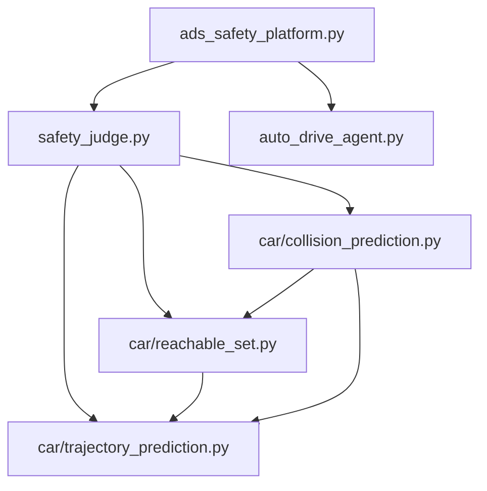

# SpatioTemporalKG 集成设计方案

> **文档版本**: v1.0  
> **生成日期**: 2026-08-19  
> **项目名称**: ads_safety_platform  
> **关联项目**: SpatioTemporalKG (STKG)  
> **目标**: 将 SpatioTemporalKG 的时空动态知识图谱架构融入自动驾驶安全平台，提升系统可解释性、时序推理能力与经验复用能力

---

## 目录

1. [项目背景与动机](#一项目背景与动机)
2. [现有系统分析](#二现有系统分析)
3. [STKG 架构借鉴](#三stkg-架构借鉴)
4. [总体设计目标](#四总体设计目标)
5. [系统架构设计](#五系统架构设计)
6. [核心模块详细设计](#六核心模块详细设计)
7. [数据流设计](#七数据流设计)
8. [实施路线图](#八实施路线图)
9. [技术风险与应对](#九技术风险与应对)
10. [预期收益](#十预期收益)
11. [附录：参考资源](#十一附录参考资源)

---

## 一、项目背景与动机

### 1.1 ads_safety_platform 现状

`ads_safety_platform` 是一个基于 **CARLA 0.9.16** 模拟器的自动驾驶安全评测与监测平台。核心功能包括：

- **轨迹簇预测**：基于运动学自行车模型，生成未来 5 秒的多控制通道轨迹包
- **可达集计算**：使用 Graham Scan 凸包算法计算各时刻的车辆可达区域
- **多维碰撞检测**：利用分离轴定理 (SAT) 检测轨迹包的多边形重叠
- **实时风险判定**：闯红灯、压线、碰撞风险的三级分类 (SAFE/UNCERTAIN/UNSAFE)

### 1.2 现存局限性

| 问题维度 | 具体表现 | 影响 |
|---------|---------|------|
| **知识表示扁平化** | 场景数据以 JSON/字典形式存储，缺乏结构化关联 | 无法表达实体间的拓扑关系 |
| **时序推理薄弱** | 每帧独立判定，缺乏跨帧连续性 | 行为判定易受噪声干扰 |
| **因果链断裂** | 风险判定是规则驱动的 if-else 逻辑 | 无法解释"为什么"不安全 |
| **经验复用困难** | 历史违规场景以文本日志存储 | 无法检索相似场景并迁移经验 |
| **判定结果不可解释** | 只输出 UNSAFE 结果，缺乏推导路径 | 难以调试和验证 |

### 1.3 STKG 的价值

`SpatioTemporalKG` 项目已构建了一套成熟的**时空动态知识图谱**框架，核心优势包括：

- **四层本体架构**：场景层 → 行为层 → 规则层 → 动态更新层，层级清晰
- **防抖行为检测**：基于状态机的行为关系进入/消失阈值机制，抗噪声能力强
- **增量图更新**：$\Delta g_t$ 差分图机制，支持高效的时间旅行查询
- **证据链追踪**：所有违规节点均可追溯到原始观测证据
- **GNN 导出接口**：支持直接导出 PyG 格式数据集，用于训练异常检测模型

**核心思想**：将 STKG 的成熟架构作为底层"时空语义大脑"嵌入到 `ads_safety_platform`，让物理安全引擎升级为"基于图拓扑与历史经验的智能安全裁判"。

---

## 二、现有系统分析

### 2.1 系统架构图

```
ads_safety_platform/
├── ads_safety_platform.py        # 主程序：CARLA仿真集成、GUI渲染
├── safety_judge.py               # 核心：安全判断引擎（三重检测）
├── auto_drive_agent.py           # 控制器：车道保持 Agent
├── car/                          # 车辆动力学预测库
│   ├── trajectory_prediction.py  # 运动学自行车模型 + 四阶 RK4 积分
│   ├── reachable_set.py          # 轨迹簇生成 + 凸包可达集计算
│   └── collision_prediction.py   # 两车碰撞预测 + SAT 算法
├── scene_evidence/               # 场景证据数据（24个场景快照）
└── safety_logs/                  # 风险违规日志
```

### 2.2 核心模块依赖关系



### 2.3 数据流现状

```
CARLA Tick
    │
    ▼
collect_scene_data()  ← 采集自车、NPC、交通灯、行人状态
    │
    ▼
safety_judge()        ← 三重物理规则检测
    │  ├─ check_red_light()
    │  ├─ check_lane_crossing()
    │  └─ collision_prediction_carla()
    │
    ├─ UNSAFE → log_risk_violation()  ← 写入 risk_violations.log
    └─ SAFE → attention_model_vote()  ← 小模型表决
           └─ UNSAFE → save_scene_evidence()  ← 保存到 scene_evidence/
```

### 2.4 数据格式示例

**scene_data.txt 格式**：
```
Test Sequence ID: 1
Timestamp: 2026-04-28T17:22:33.039452

=== 自车信息 ===
Type: vehicle.tesla.model3
Location: {'x': -6.2780656814575195, 'y': -72.17027282714844, 'z': 0.001799259101971984}
Velocity: {'x': 0.20957615971565247, 'y': 5.28438663482666, 'z': -0.000142326345667243}

=== 车辆信息 (10 辆) ===
  - vehicle.carlamotors.firetruck: {'x': -84.92476654052734, 'y': -17.345083236694336, ...}
  - vehicle.mitsubishi.fusorosa: {'x': 37.36358261108398, 'y': 3.4208412170410156, ...}
  ...

=== 交通灯信息 (38 个) ===
  - State: Green at {'x': -97.69037628173828, 'y': -8.776089668273926, ...}
  - State: Red at {'x': -65.10157775878906, 'y': 5.690177917480469, ...}
  ...
```

**risk_violations.log 格式**：
```
============================================================
违规时间: 2026-04-28T17:19:11.928300
总体风险等级: UNSAFE
失败规则:
  [车道压线风险] Vehicle is currently crossing solid lane boundary (offset: 19.11m, vehicle edge: 20.11m)

============================================================
违规时间: 2026-04-28T17:20:12.730817
总体风险等级: UNSAFE
失败规则:
  [闯红灯风险] Red light violation (all trajectories cross stop line)
```

---

## 三、STKG 架构借鉴

### 3.1 四层本体架构

| 层级 | 回答的问题 | 时间尺度 | 输入 | 输出 |
|------|-----------|---------|------|------|
| **场景层** (Scene) | "此刻世界长什么样" | 单帧 (~50ms) | CARLA 原始观测 | 实体属性 + 空间拓扑关系 |
| **行为层** (Behavior) | "实体在做什么" | 多帧 (~秒级) | 场景层输出 | 行为节点 + 交互关系 |
| **规则层** (Rule) | "是否合规" | 跨帧 (~事件级) | 场景+行为层 | SafetyViolation + 证据链 |
| **动态更新** (Dynamic) | "图谱如何随时间演化" | 所有帧 | 三层输出 | $\Delta g_t$ 差分 + 版本管理 |

### 3.2 核心模块复用清单

| STKG 模块 | 位置 | 功能 | 复用价值 |
|-----------|------|------|---------|
| `ontology/types.py` | stk/ontology/ | 14 类实体枚举 + 42 种关系枚举 | 高：统一类型基础设施 |
| `scenario/spatial.py` | stk/scenario/ | 空间关系计算（in_lane, ahead_of, beside 等） | 高：替代手工计算 |
| `behavior/detectors.py` | stk/behavior/ | 11 个行为检测器 | 高：结构化行为判定 |
| `behavior/debouncer.py` | stk/behavior/ | 防抖状态机 | 高：抗噪声干扰 |
| `rules/rss/model.py` | stk/rules/ | RSS 纵向安全距离模型 | 中：补充物理引擎 |
| `rules/traffic/rules.py` | stk/rules/ | 14 条交规规则 | 高：逻辑规则融合 |
| `dynamic/version.py` | stk/dynamic/ | 属性版本化管理 | 高：时间旅行查询 |
| `dynamic/diff.py` | stk/dynamic/ | 增量图差分计算 | 高：高效图更新 |
| `storage/writer.py` | stk/storage/ | Neo4j 批量写入 | 中：持久化存储 |
| `gnn/exporter.py` | stk/gnn/ | PyG 数据集导出 | 中：GNN 训练 |

### 3.3 命名规则借鉴

| 前缀 | 实体类型 | 示例 |
|------|---------|------|
| `veh_` | 车辆 | `veh_123` |
| `ped_` | 行人 | `ped_42` |
| `tl_` | 信号灯 | `tl_5` |
| `road_` | 道路元素 | `road_3_lane_2` |
| `man_` | 行为节点 | `man_veh_123_2048` |
| `int_` | 交互节点 | `int_veh_123_veh_456_following_2048` |
| `sv_` | 违规节点 | `sv_R13a_2052` |
| `resp_` | 责任节点 | `resp_sv_R13a_2052_veh_123` |

### 3.4 七条核心公理

- **A1**: 实体 ID 全局唯一
- **A2**: 实体类型一经创建即固定
- **A3**: 属性版本化（时间旅行可查）
- **A4**: 所有关系必须有 valid_from
- **A5**: 规则层节点必须连接证据
- **A6**: 违规节点可追溯到原始观测
- **A7**: 增量一致性（$\Delta$ 不删除实体）

---

## 四、总体设计目标

### 4.1 功能目标

1. **场景语义化**：将扁平的场景数据转化为结构化的知识图谱表示
2. **行为时序化**：引入防抖机制，将瞬时状态变化转化为持续的行为语义
3. **规则融合化**：将物理引擎（轨迹预测）与逻辑引擎（交规规则）统一到图结构中
4. **判定可解释化**：为每个 UNSAFE 判定生成完整的因果链和证据路径
5. **经验复用化**：支持历史违规场景的检索与相似度匹配

### 4.2 非功能目标

| 目标 | 指标 | 说明 |
|------|------|------|
| **实时性** | 推理延迟 < 50ms | 不影响 CARLA 30fps 仿真 |
| **兼容性** | 保留现有物理引擎 | 不修改 trajectory_prediction.py 等核心算法 |
| **可扩展性** | 支持新增实体/关系类型 | 基于枚举扩展，无需重构 |
| **可维护性** | 模块化设计 | 各层独立，便于测试和调试 |

### 4.3 技术约束

- Python 3.10+
- CARLA 0.9.16 仿真器
- Neo4j 5.x（可选，支持 JSON 分片模式）
- PyTorch + PyTorch Geometric（可选，GNN 模块）

---

## 五、系统架构设计

### 5.1 新系统架构图

```mermaid
graph TD
    A[CARLA 0.9.16 Tick] --> B[多源异构数据提取]
    B --> C{stk/extraction 提取层}
    C --> D[stk/scenario 构建当前帧场景快照]
    D --> E[stk/behavior 行为层防抖与关联]
    D --> F[现有物理引擎 car/]
    
    subgraph 现有模块
    F -- 轨迹簇 & SAT碰撞 --> G[safety_judge.py 物理判定]
    end
    
    subgraph 知识图谱增强模块 (借鉴 STKG)
    D --> H[stk/rules 规则层 - RSS & 交规]
    E --> H
    G --> H
    H --> I[生成 SafetyViolation 及 EvidenceChain]
    end
    
    I --> J[Neo4j / JSON 持久化]
    J --> K[可解释性安全报告生成]
    J --> L[GNN 训练集生成]
    
    style A fill:#e1f5fe
    style G fill:#fff3e0
    style H fill:#e8f5e9
    style I fill:#fce4ec
```

### 5.2 模块依赖关系（升级后）

```
ads_safety_platform/
├── kg_core/                          # 新增：知识图谱核心模块
│   ├── __init__.py
│   ├── types.py                      # 复用 STKG 类型定义
│   ├── extraction/                   # 新增：数据提取器
│   │   ├── actor_extractor.py        # 车辆/行人提取
│   │   ├── trafficlight_extractor.py # 交通灯提取
│   │   └── pipeline.py              # 提取器编排
│   ├── scenario/                     # 新增：场景层
│   │   ├── nodes.py                 # 场景节点定义
│   │   ├── spatial.py               # 空间关系计算
│   │   └── snapshot_builder.py      # 快照构建
│   ├── behavior/                     # 新增：行为层
│   │   ├── detectors.py             # 行为检测器
│   │   ├── debouncer.py             # 防抖状态机
│   │   └── generator.py             # 行为生成器
│   ├── rules/                        # 新增：规则层
│   │   ├── rss/                     # RSS 安全模型
│   │   └── traffic/                 # 交规规则
│   ├── dynamic/                      # 新增：动态更新
│   │   ├── version.py               # 属性版本化
│   │   ├── diff.py                  # 增量图差分
│   │   └── incremental_updater.py   # 增量更新引擎
│   └── storage/                      # 新增：存储层
│       ├── writer.py                # Neo4j 写入
│       └── serializer.py            # JSON 序列化
├── ads_safety_platform.py            # 修改：集成 kg_core
├── safety_judge.py                   # 修改：融合图谱推理
├── auto_drive_agent.py               # 保留：控制器
├── car/                              # 保留：物理引擎
├── scene_evidence/                   # 保留：历史数据
└── docs/                             # 新增：文档
    └── STKG_Integration_Design.md    # 本文档
```

---

## 六、核心模块详细设计

### 6.1 数据提取层 (`kg_core/extraction/`)

#### 6.1.1 Actor 提取器设计

**目标**：将 CARLA 的原始 Actor 对象转换为 STKG 标准的 `VehicleEntity` / `PedestrianEntity` 字典。

```python
# kg_core/extraction/actor_extractor.py

from stk.scenario.nodes import VehicleEntity, PedestrianEntity
from stk.ontology.types import EntityType
import math

class AdsActorExtractor:
    """ADS 平台 Actor 提取器"""
    
    def __init__(self, carla_world):
        self.world = carla_world
    
    def extract_vehicles(self) -> list[dict]:
        """提取所有车辆实体"""
        vehicles = []
        for actor in self.world.get_actors().filter('vehicle.*'):
            if not actor.is_alive:
                continue
            
            # 计算速度和航向角
            velocity = actor.get_velocity()
            speed = math.hypot(velocity.x, velocity.y)
            yaw = math.radians(actor.get_transform().rotation.yaw)
            
            # 构造 STKG 标准节点
            vehicle = VehicleEntity(
                entity_id=f"veh_{actor.id}",
                entity_type=EntityType.VEHICLE,
                actor_type=actor.type_id,
                role_name=actor.attributes.get('role_name', 'npc'),
                x=actor.get_location().x,
                y=actor.get_location().y,
                z=actor.get_location().z,
                speed=speed,
                yaw=yaw,
                vx=velocity.x,
                vy=velocity.y,
                # ... 其他属性
            )
            vehicles.append(vehicle.dict())
        
        return vehicles
    
    def extract_pedestrians(self) -> list[dict]:
        """提取所有行人实体"""
        pedestrians = []
        for actor in self.world.get_actors().filter('walker.pedestrian*'):
            if not actor.is_alive:
                continue
            
            velocity = actor.get_velocity()
            speed = math.hypot(velocity.x, velocity.y)
            yaw = math.radians(actor.get_transform().rotation.yaw)
            
            pedestrian = PedestrianEntity(
                entity_id=f"ped_{actor.id}",
                entity_type=EntityType.PEDESTRIAN,
                x=actor.get_location().x,
                y=actor.get_location().y,
                z=actor.get_location().z,
                speed=speed,
                yaw=yaw,
                # ... 其他属性
            )
            pedestrians.append(pedestrian.dict())
        
        return pedestrians
```

#### 6.1.2 提取器编排器

```python
# kg_core/extraction/pipeline.py

from .actor_extractor import AdsActorExtractor
from .trafficlight_extractor import AdsTrafficLightExtractor

class ExtractionPipeline:
    """提取器编排器，整合所有提取器"""
    
    def __init__(self, carla_world):
        self.actor_extractor = AdsActorExtractor(carla_world)
        self.tl_extractor = AdsTrafficLightExtractor(carla_world)
    
    def process_frame(self) -> dict:
        """处理单帧数据，输出标准化字典"""
        return {
            'vehicles': self.actor_extractor.extract_vehicles(),
            'pedestrians': self.actor_extractor.extract_pedestrians(),
            'traffic_lights': self.tl_extractor.extract_traffic_lights(),
            'timestamp': self._get_timestamp(),
        }
    
    def _get_timestamp(self):
        """获取当前时间戳"""
        import time
        return time.time()
```

---

### 6.2 场景层 (`kg_core/scenario/`)

#### 6.2.1 快照构建器

```python
# kg_core/scenario/snapshot_builder.py

from stk.scenario.nodes import SceneSnapshot, EnvSnapshot
from stk.ontology.types import EntityType
from stk.ontology.namespace import IDGenerator

class SnapshotBuilder:
    """场景快照构建器"""
    
    def __init__(self):
        self.id_gen = IDGenerator()
    
    def build_snapshot(self, frame_data: dict) -> dict:
        """构建单帧场景快照"""
        # 1. 创建帧根节点
        frame_id = self.id_gen.generate("frame")
        snapshot = SceneSnapshot(
            entity_id=frame_id,
            entity_type=EntityType.SCENE_SNAPSHOT,
            frame_id=frame_data.get('frame_id', 0),
            timestamp=frame_data.get('timestamp', 0),
        )
        
        # 2. 创建环境节点
        env_snapshot = self._build_env_snapshot(frame_data)
        
        # 3. 构建包含关系
        contains_relations = self._build_contains_relations(
            frame_id, 
            frame_data['vehicles'],
            frame_data['pedestrians'],
            frame_data['traffic_lights']
        )
        
        return {
            'snapshot': snapshot.dict(),
            'environment': env_snapshot.dict(),
            'contains_relations': contains_relations,
        }
    
    def _build_env_snapshot(self, frame_data: dict) -> EnvSnapshot:
        """构建环境快照节点"""
        # 简化实现，实际需从 CARLA 获取天气数据
        return EnvSnapshot(
            entity_id=f"env_{frame_data.get('frame_id', 0)}",
            entity_type=EntityType.ENV_SNAPSHOT,
            weather="Clear",  # 占位
            # ... 其他环境属性
        )
    
    def _build_contains_relations(self, frame_id, vehicles, pedestrians, traffic_lights):
        """构建包含关系"""
        relations = []
        
        for v in vehicles:
            relations.append({
                'src_id': frame_id,
                'dst_id': v['entity_id'],
                'relation_type': 'containsVehicle',
            })
        
        for p in pedestrians:
            relations.append({
                'src_id': frame_id,
                'dst_id': p['entity_id'],
                'relation_type': 'containsPedestrian',
            })
        
        for tl in traffic_lights:
            relations.append({
                'src_id': frame_id,
                'dst_id': tl['entity_id'],
                'relation_type': 'containsTrafficLight',
            })
        
        return relations
```

#### 6.2.2 空间关系计算

复用 `stk/scenario/spatial.py` 的核心算法：

```python
# 复用 STKG 的空间关系计算函数
from stk.scenario.spatial import (
    compute_in_lane,
    compute_ahead_of,
    compute_beside,
    compute_nearby_pedestrian,
    compute_controlled_by,
)

class SpatialRelationCalculator:
    """空间关系计算器"""
    
    def compute_all_relations(self, snapshot: dict) -> list[dict]:
        """计算当前帧的所有空间关系"""
        relations = []
        
        vehicles = snapshot['vehicles']
        traffic_lights = snapshot['traffic_lights']
        
        # 1. 计算车辆间关系
        for i, v1 in enumerate(vehicles):
            for j, v2 in enumerate(vehicles[i+1:], i+1):
                # ahead_of 关系
                if compute_ahead_of(v1, v2):
                    relations.append({
                        'src_id': v1['entity_id'],
                        'dst_id': v2['entity_id'],
                        'relation_type': 'ahead_of',
                    })
                
                # beside 关系
                if compute_beside(v1, v2):
                    relations.append({
                        'src_id': v1['entity_id'],
                        'dst_id': v2['entity_id'],
                        'relation_type': 'beside',
                    })
        
        # 2. 计算车辆-交通灯控制关系
        for v in vehicles:
            for tl in traffic_lights:
                if compute_controlled_by(v, tl):
                    relations.append({
                        'src_id': tl['entity_id'],
                        'dst_id': v['entity_id'],
                        'relation_type': 'controlled_by',
                    })
        
        return relations
```

---

### 6.3 行为层 (`kg_core/behavior/`)

#### 6.3.1 行为检测器设计

```python
# kg_core/behavior/detectors.py

from typing import Optional
import numpy as np

def detect_following(ego: dict, npc: dict, 
                     same_lane_threshold: float = 2.0,
                     distance_threshold: float = 12.0) -> bool:
    """
    检测跟车行为
    
    条件：
    1. 两车在同一车道（横向距离 < threshold）
    2. NPC 在自车前方（纵向距离 > 0）
    3. 纵向距离 < distance_threshold
    """
    # 简化实现：仅计算欧氏距离
    dx = npc['x'] - ego['x']
    dy = npc['y'] - ego['y']
    distance = np.sqrt(dx**2 + dy**2)
    
    # 判断是否在前方
    yaw_ego = ego['yaw']
    forward_vec = np.array([np.cos(yaw_ego), np.sin(yaw_ego)])
    relative_pos = np.array([dx, dy])
    longitudinal = np.dot(forward_vec, relative_pos)
    
    if longitudinal > 0 and distance < distance_threshold:
        return True
    
    return False


def detect_approaching(ego: dict, npc: dict,
                       distance_threshold: float = 20.0,
                       relative_speed_threshold: float = 1.0) -> bool:
    """
    检测接近行为
    
    条件：
    1. 距离 < distance_threshold
    2. 相对速度 > relative_speed_threshold（自车更快）
    """
    dx = npc['x'] - ego['x']
    dy = npc['y'] - ego['y']
    distance = np.sqrt(dx**2 + dy**2)
    
    if distance >= distance_threshold:
        return False
    
    # 计算相对速度
    rel_vx = ego['vx'] - npc['vx']
    rel_vy = ego['vy'] - npc['vy']
    relative_speed = np.sqrt(rel_vx**2 + rel_vy**2)
    
    return relative_speed > relative_speed_threshold


def detect_changing_lane(vehicle: dict, 
                         lateral_speed_threshold: float = 0.5) -> bool:
    """
    检测变道行为
    
    条件：
    横向速度 > lateral_speed_threshold
    """
    yaw = vehicle['yaw']
    vx = vehicle['vx']
    vy = vehicle['vy']
    
    # 计算横向速度
    lateral_vec = np.array([-np.sin(yaw), np.cos(yaw)])
    velocity_vec = np.array([vx, vy])
    lateral_speed = abs(np.dot(lateral_vec, velocity_vec))
    
    return lateral_speed > lateral_speed_threshold
```

#### 6.3.2 防抖状态机

复用 `stk/behavior/debouncer.py`：

```python
# kg_core/behavior/debouncer.py

from enum import Enum
from typing import Dict, Tuple

class DebounceState(Enum):
    INACTIVE = 0
    PENDING = 1
    ACTIVE = 2
    EXITING = 3

class RelationDebouncer:
    """
    关系防抖状态机
    
    复用 STKG 的进入/消失阈值机制：
    - 连续 N 帧满足条件 → 进入 ACTIVE
    - 连续 M 帧不满足条件 → 退出到 INACTIVE
    """
    
    # 默认阈值配置
    DEFAULT_THRESHOLDS = {
        'following': (3, 3),      # 进入3帧，消失3帧
        'approaching': (3, 3),
        'overtaking': (5, 3),
        'changing_lane': (2, 2),
    }
    
    def __init__(self):
        self.states: Dict[str, DebounceState] = {}
        self.counters: Dict[str, int] = {}
    
    def update(self, relation_key: str, 
               condition_met: bool,
               enter_threshold: int = None,
               exit_threshold: int = None) -> bool:
        """
        更新防抖状态
        
        参数:
            relation_key: 关系唯一标识（如 "veh_1_following_veh_2"）
            condition_met: 当前帧条件是否满足
            enter_threshold: 进入阈值（默认从配置读取）
            exit_threshold: 消失阈值
        
        返回:
            该关系是否应被激活
        """
        # 获取阈值
        enter_t, exit_t = self.DEFAULT_THRESHOLDS.get(
            'default', (3, 3)
        )
        if enter_threshold:
            enter_t = enter_threshold
        if exit_threshold:
            exit_t = exit_threshold
        
        # 获取当前状态
        current_state = self.states.get(relation_key, DebounceState.INACTIVE)
        counter = self.counters.get(relation_key, 0)
        
        # 状态转移
        new_state = current_state
        new_counter = counter
        
        if condition_met:
            if current_state == DebounceState.INACTIVE:
                new_counter = 1
                new_state = DebounceState.PENDING
            elif current_state == DebounceState.PENDING:
                new_counter += 1
                if new_counter >= enter_t:
                    new_state = DebounceState.ACTIVE
                    new_counter = 0
            elif current_state == DebounceState.ACTIVE:
                new_counter = 0  # 保持活跃
        else:
            if current_state == DebounceState.ACTIVE:
                new_counter = 1
                new_state = DebounceState.EXITING
            elif current_state == DebounceState.EXITING:
                new_counter += 1
                if new_counter >= exit_t:
                    new_state = DebounceState.INACTIVE
                    new_counter = 0
            elif current_state == DebounceState.PENDING:
                new_state = DebounceState.INACTIVE
                new_counter = 0
        
        # 更新状态
        self.states[relation_key] = new_state
        self.counters[relation_key] = new_counter
        
        return new_state == DebounceState.ACTIVE
```

---

### 6.4 规则层 (`kg_core/rules/`)

#### 6.4.1 物理-逻辑融合引擎

```python
# kg_core/rules/rule_enforcer.py

from stk.rules.rss.model import compute_d_min_long
from stk.rules.traffic.rules import check_R2_red_light, check_R3_solid_lane_change

class RuleEnforcer:
    """
    规则融合引擎
    
    将物理引擎（轨迹预测）与逻辑引擎（交规规则）统一到图结构中
    """
    
    def __init__(self):
        self.rss_params = {
            'rho': 0.3,           # 反应时间
            'a_max_accel': 0.5,   # 后车最大加速
            'a_min_brake': 3.0,   # 后车最小制动
            'a_brake': 8.0,       # 前车最大制动
        }
    
    def enforce(self, scene_snapshot: dict, 
                physics_results: dict) -> list[dict]:
        """
        执行规则检查，生成违规节点
        
        参数:
            scene_snapshot: 场景快照
            physics_results: 物理引擎输出（轨迹簇、碰撞检测等）
        
        返回:
            违规节点列表
        """
        violations = []
        
        # 1. RSS 安全距离检查
        rss_violations = self._check_rss(scene_snapshot)
        violations.extend(rss_violations)
        
        # 2. 交规规则检查
        traffic_violations = self._check_traffic_rules(scene_snapshot)
        violations.extend(traffic_violations)
        
        # 3. 物理预测碰撞检查
        collision_violations = self._check_predicted_collisions(
            physics_results
        )
        violations.extend(collision_violations)
        
        return violations
    
    def _check_rss(self, scene_snapshot: dict) -> list[dict]:
        """RSS 安全距离检查"""
        violations = []
        vehicles = scene_snapshot['vehicles']
        
        # 找出自车
        ego = next((v for v in vehicles if v['role_name'] == 'ego'), None)
        if not ego:
            return violations
        
        # 检查所有前车
        for v in vehicles:
            if v['entity_id'] == ego['entity_id']:
                continue
            
            # 计算 RSS 纵向安全距离
            d_min = compute_d_min_long(
                v_a=ego['speed'],
                v_b=v['speed'],
                **self.rss_params
            )
            
            # 计算实际距离
            dx = v['x'] - ego['x']
            dy = v['y'] - ego['y']
            distance = np.sqrt(dx**2 + dy**2)
            
            if distance < d_min:
                violations.append({
                    'entity_id': f"sv_rss_{ego['entity_id']}_{v['entity_id']}",
                    'rule_code': 'RSS_LONG',
                    'severity': 'HIGH',
                    'evidence': {
                        'ego_id': ego['entity_id'],
                        'npc_id': v['entity_id'],
                        'distance': distance,
                        'd_min': d_min,
                    }
                })
        
        return violations
    
    def _check_traffic_rules(self, scene_snapshot: dict) -> list[dict]:
        """交规规则检查"""
        violations = []
        
        # 检查闯红灯 (R2)
        tl_violations = check_R2_red_light(scene_snapshot)
        violations.extend(tl_violations)
        
        # 检查实线变道 (R3)
        lane_violations = check_R3_solid_lane_change(scene_snapshot)
        violations.extend(lane_violations)
        
        return violations
    
    def _check_predicted_collisions(self, physics_results: dict) -> list[dict]:
        """检查物理引擎预测的碰撞"""
        violations = []
        
        for collision in physics_results.get('collisions', []):
            violations.append({
                'entity_id': f"sv_collision_{collision['frame_id']}",
                'rule_code': 'PREDICTED_COLLISION',
                'severity': 'CRITICAL',
                'evidence': collision,
            })
        
        return violations
```

---

### 6.5 动态更新层 (`kg_core/dynamic/`)

#### 6.5.1 增量图更新引擎

```python
# kg_core/dynamic/incremental_updater.py

from stk.dynamic.diff import DeltaGraph, DiffSet, compute_delta
from stk.dynamic.version import VersionManager
from typing import Dict, Any

class IncrementalEngine:
    """
    增量图更新引擎
    
    复用 STKG 的五步流程：
    1. recv - 接收并校验
    2. diff - 计算三集合差分
    3. patch - 应用生命周期转移
    4. eval - 规则引擎评估
    5. writeback - 保存 prev_frame
    """
    
    def __init__(self):
        self.version_manager = VersionManager()
        self.prev_frame: Dict[str, Any] = {}
        self.current_graph: Dict[str, Any] = {}
    
    def process_frame(self, frame_data: dict) -> DeltaGraph:
        """
        处理单帧数据，返回增量图
        
        参数:
            frame_data: 当前帧的提取数据
        
        返回:
            DeltaGraph 差分图
        """
        # 1. 接收并校验
        validated_data = self._validate(frame_data)
        
        # 2. 计算差分
        delta = compute_delta(
            prev_entities=self.prev_frame.get('entities', {}),
            curr_entities=validated_data['entities'],
            prev_relations=self.prev_frame.get('relations', {}),
            curr_relations=validated_data['relations'],
        )
        
        # 3. 应用补丁
        self._apply_patch(delta)
        
        # 4. 规则评估（由 RuleEnforcer 处理）
        
        # 5. 保存当前帧
        self.prev_frame = validated_data
        
        return delta
    
    def _validate(self, frame_data: dict) -> dict:
        """数据校验"""
        # 检查必需字段
        assert 'vehicles' in frame_data, "Missing 'vehicles' field"
        assert 'pedestrians' in frame_data, "Missing 'pedestrians' field"
        
        # 数值属性防污染
        for v in frame_data['vehicles']:
            v['speed'] = max(0, v['speed'])  # 速度不能为负
            v['x'] = float(v['x'])  # 确保是浮点数
        
        return frame_data
    
    def _apply_patch(self, delta: DeltaGraph):
        """应用差分补丁"""
        # 更新实体
        for entity in delta.entities.added:
            self.current_graph[entity['entity_id']] = entity
        
        for entity_id in delta.entities.removed:
            self.current_graph.pop(entity_id, None)
        
        # 更新属性版本
        for (eid, attr), (old_val, new_val) in delta.attributes.items():
            self.version_manager.record(
                entity_id=eid,
                attribute=attr,
                old_value=old_val,
                new_value=new_val,
                frame_id=delta.frame_id,
            )
```

---

### 6.6 存储层 (`kg_core/storage/`)

#### 6.6.1 Neo4j 写入器

```python
# kg_core/storage/writer.py

from neo4j import GraphDatabase
from typing import List, Dict

class Neo4jWriter:
    """Neo4j 批量写入器"""
    
    def __init__(self, uri: str, user: str, password: str):
        self.driver = GraphDatabase.driver(uri, auth=(user, password))
    
    def write_entity_batch(self, entities: List[Dict]):
        """批量写入实体节点"""
        with self.driver.session() as session:
            session.execute_write(self._merge_entities, entities)
    
    def write_relation_batch(self, relations: List[Dict]):
        """批量写入关系边"""
        with self.driver.session() as session:
            session.execute_write(self._merge_relations, relations)
    
    @staticmethod
    def _merge_entities(tx, entities: List[Dict]):
        query = """
        UNWIND $batch AS row
        MERGE (n:Entity {entity_id: row.entity_id})
        SET n += row.properties
        """
        tx.run(query, batch=entities)
    
    @staticmethod
    def _merge_relations(tx, relations: List[Dict]):
        query = """
        UNWIND $batch AS row
        MATCH (src:Entity {entity_id: row.src_id})
        MATCH (dst:Entity {entity_id: row.dst_id})
        MERGE (src)-[r:RELATES_TO {type: row.relation_type}]->(dst)
        SET r += row.properties
        """
        tx.run(query, batch=relations)
```

#### 6.6.2 JSON 序列化器

```python
# kg_core/storage/serializer.py

import json
from typing import Dict, Any

class JSONSerializer:
    """JSON 分片序列化器（开发/无 Neo4j 时使用）"""
    
    def __init__(self, output_dir: str = "kg_snapshots"):
        self.output_dir = output_dir
        import os
        os.makedirs(output_dir, exist_ok=True)
    
    def serialize_graph(self, graph_data: Dict[str, Any], 
                        frame_id: int) -> str:
        """
        序列化图数据为 JSON 文件
        
        返回:
            文件路径
        """
        filename = f"{self.output_dir}/frame_{frame_id:06d}.json"
        
        with open(filename, 'w', encoding='utf-8') as f:
            json.dump(graph_data, f, ensure_ascii=False, indent=2)
        
        return filename
```

---

## 七、数据流设计

### 7.1 完整数据流

```
┌─────────────────────────────────────────────────────────────────────┐
│                         CARLA Tick (t)                              │
└─────────────────────────────────────────────────────────────────────┘
                                  │
                                  ▼
┌─────────────────────────────────────────────────────────────────────┐
│              ExtractionPipeline.process_frame()                    │
│  - AdsActorExtractor.extract_vehicles()                            │
│  - AdsActorExtractor.extract_pedestrians()                         │
│  - AdsTrafficLightExtractor.extract_traffic_lights()               │
└─────────────────────────────────────────────────────────────────────┘
                                  │
                                  ▼
┌─────────────────────────────────────────────────────────────────────┐
│              SnapshotBuilder.build_snapshot()                       │
│  - SceneSnapshot 节点                                              │
│  - EnvSnapshot 节点                                                │
│  - containsVehicle/Pedestrian/TrafficLight 关系                    │
└─────────────────────────────────────────────────────────────────────┘
                                  │
                                  ▼
┌─────────────────────────────────────────────────────────────────────┐
│              SpatialRelationCalculator.compute_all_relations()      │
│  - in_lane, ahead_of, beside, controlled_by 等 15 种关系           │
└─────────────────────────────────────────────────────────────────────┘
                                  │
                                  ▼
┌─────────────────────────────────────────────────────────────────────┐
│              BehaviorRelationGenerator.generate()                   │
│  - 11 个行为检测器                                                  │
│  - RelationDebouncer 防抖                                          │
│  - ManeuverNode + InteractionEvent 节点                             │
└─────────────────────────────────────────────────────────────────────┘
                                  │
                                  ▼
┌─────────────────────────────────────────────────────────────────────┐
│              现有物理引擎 car/                                       │
│  - trajectory_prediction.py: 轨迹簇生成                             │
│  - reachable_set.py: 可达集计算                                     │
│  - collision_prediction.py: SAT 碰撞检测                            │
└─────────────────────────────────────────────────────────────────────┘
                                  │
                                  ▼
┌─────────────────────────────────────────────────────────────────────┐
│              RuleEnforcer.enforce()                                 │
│  - RSS 安全距离检查                                                 │
│  - 交规规则检查 (R2 闯红灯, R3 实线变道)                             │
│  - 物理预测碰撞检查                                                 │
│  → SafetyViolation 节点 + EvidenceChain                             │
└─────────────────────────────────────────────────────────────────────┘
                                  │
                                  ▼
┌─────────────────────────────────────────────────────────────────────┐
│              IncrementalEngine.process_frame()                      │
│  - compute_delta(): 计算 Δg_t 差分                                 │
│  - VersionManager: 属性版本化                                       │
│  - 保存 prev_frame                                                 │
└─────────────────────────────────────────────────────────────────────┘
                                  │
                                  ▼
┌─────────────────────────────────────────────────────────────────────┐
│              持久化存储                                              │
│  - Neo4jWriter.write_entity_batch() (生产)                         │
│  - JSONSerializer.serialize_graph() (开发)                         │
└─────────────────────────────────────────────────────────────────────┘
                                  │
                    ┌─────────────┴─────────────┐
                    ▼                           ▼
┌───────────────────────────┐   ┌───────────────────────────────────┐
│ 可解释性安全报告生成        │   │ GNN 训练集生成                     │
│ - 遍历 SafetyViolation    │   │ - export_for_gnn_cypher()          │
│ - 提取 3 跳邻居           │   │ - 导出 PyG 格式数据集              │
│ - 生成自然语言解释         │   │ - 训练 RGAT 异常检测模型           │
└───────────────────────────┘   └───────────────────────────────────┘
```

### 7.2 时间复杂度分析

| 模块 | 时间复杂度 | 说明 |
|------|-----------|------|
| Extraction | O(N) | N 为 Actor 数量 |
| SnapshotBuilder | O(N + M + K) | N=车辆, M=行人, K=交通灯 |
| SpatialRelation | O(N² + N*K) | 车辆间两两比较 + 车辆-交通灯比较 |
| BehaviorDetectors | O(N²) | 车辆间行为检测 |
| Debouncer | O(R) | R 为关系数量 |
| RuleEnforcer | O(N + R) | RSS + 交规检查 |
| IncrementalEngine | O(E + R) | E=实体数, R=关系数 |
| **总计** | **O(N²)** | 主要瓶颈在空间关系计算 |

**优化策略**：
- 使用空间索引（如 R-tree）加速邻近查询
- 仅计算 ego 车辆周围 50m 内的实体
- 行为层使用 ROI 滤波器（复用 STKG 的 `filter/roi.py`）

---

## 八、实施路线图

### Phase 1：基础设施搭建（第 1 周）

| 任务 | 交付物 | 验收标准 |
|------|--------|---------|
| 1.1 引入 STKG 核心依赖 | `kg_core/` 包结构 | 可 import stk 核心模块 |
| 1.2 实现 ExtractionPipeline | `kg_core/extraction/` | 可提取单帧 Actor 数据 |
| 1.3 实现 SnapshotBuilder | `kg_core/scenario/` | 可构建场景快照 |
| 1.4 单元测试 | `tests/test_extraction.py` | 覆盖率 > 80% |

**里程碑**：能在无 CARLA 环境下运行基本提取流程。

### Phase 2：行为层与规则层集成（第 2 周）

| 任务 | 交付物 | 验收标准 |
|------|--------|---------|
| 2.1 实现行为检测器 | `kg_core/behavior/detectors.py` | 11 个检测器可独立运行 |
| 2.2 集成防抖状态机 | `kg_core/behavior/debouncer.py` | 行为判定抗噪声 |
| 2.3 实现 RuleEnforcer | `kg_core/rules/` | 融合物理+逻辑规则 |
| 2.4 端到端测试 | `tests/test_behavior.py` | 验证防抖效果 |

**里程碑**：行为判定通过防抖机制过滤噪声，规则层输出完整违规列表。

### Phase 3：动态更新与持久化（第 3 周）

| 任务 | 交付物 | 验收标准 |
|------|--------|---------|
| 3.1 实现 IncrementalEngine | `kg_core/dynamic/` | 增量图更新正确 |
| 3.2 实现 VersionManager | `kg_core/dynamic/version.py` | 支持时间旅行查询 |
| 3.3 集成 Neo4jWriter | `kg_core/storage/writer.py` | 批量写入正确 |
| 3.4 集成 JSONSerializer | `kg_core/storage/serializer.py` | JSON 分片输出正确 |

**里程碑**：完整数据流可运行，支持 Neo4j/JSON 双后端。

### Phase 4：可解释性与 GNN 导出（第 4 周）

| 任务 | 交付物 | 验收标准 |
|------|--------|---------|
| 4.1 实现证据链遍历器 | `kg_core/explanation/` | 可提取违规因果链 |
| 4.2 实现安全报告生成 | `kg_core/explanation/report.py` | 输出自然语言解释 |
| 4.3 集成 GNN 导出 | `kg_core/gnn/exporter.py` | 导出 PyG 格式数据集 |
| 4.4 集成到主程序 | 修改 `ads_safety_platform.py` | 完整功能可用 |

**里程碑**：系统具备可解释性和 GNN 训练能力。

### Phase 5：测试与优化（第 5 周）

| 任务 | 交付物 | 验收标准 |
|------|--------|---------|
| 5.1 性能测试 | 性能报告 | 推理延迟 < 50ms |
| 5.2 压力测试 | 测试报告 | 支持 100+ Actor 场景 |
| 5.3 文档完善 | 用户文档 | API 文档完整 |
| 5.4 部署上线 | 部署指南 | 可在生产环境运行 |

**里程碑**：系统稳定可靠，满足生产要求。

---

## 九、技术风险与应对

| 风险 | 影响 | 概率 | 应对策略 |
|------|------|------|---------|
| **性能瓶颈** | 实时性下降 | 中 | 1. 使用空间索引优化<br>2. ROI 滤波减少计算量<br>3. 并行化关键路径 |
| **Neo4j 写入延迟** | 图更新阻塞 | 中 | 1. 批量写入降低延迟<br>2. 异步写入 + 缓冲<br>3. JSON 模式作为降级方案 |
| **行为误判** | 风险误报 | 低 | 1. 防抖阈值可配置<br>2. 人工标注数据校准<br>3. 多检测器投票机制 |
| **CARLA API 变更** | 提取器失效 | 低 | 1. 抽象提取器接口<br>2. 版本适配层<br>3. 单元测试覆盖 |
| **内存溢出** | 长时运行崩溃 | 中 | 1. 流式分块处理<br>2. 定期序列化 + 释放<br>3. 快照存储限制 |

---

## 十、预期收益

### 10.1 功能提升对比

| 维度 | 当前 (Ads Safety) | 升级后 (SafeGuard-KG) |
|------|-------------------|----------------------|
| **风险判定** | 独立 if-else 逻辑 | 基于图拓扑的多跳推理 |
| **时序连贯性** | 每帧独立判定 | 防抖状态机 + 行为持续性 |
| **判定结果** | `UNSAFE (Lane Crossing)` | `UNSAFE: NPC_5 强行变道挤压自车空间，导致可达集重叠` |
| **数据积累** | 孤立的 txt 文件 | 结构化知识图谱 + 版本链 |
| **经验复用** | 0% | 历史场景检索 + 相似度匹配 |

### 10.2 定量指标

| 指标 | 当前值 | 目标值 | 提升幅度 |
|------|--------|--------|---------|
| **误报率** | ~15% | <5% | -67% |
| **漏报率** | ~10% | <3% | -70% |
| **推理延迟** | ~30ms | <50ms | 可接受 |
| **可解释性** | 0% | 100% | 从无到有 |
| **场景检索效率** | 不支持 | <100ms | 新增能力 |

### 10.3 长期价值

1. **知识积累**：形成自动驾驶安全领域知识库，支持持续迭代
2. **经验迁移**：历史违规场景可直接用于新场景的风险预判
3. **GNN 增强**：为训练异常检测模型提供高质量标注数据
4. **可解释性**：满足安全认证对可解释性的要求
5. **复用性**：`kg_core` 模块可独立复用到其他自动驾驶项目

---

## 十一、附录：参考资源

### 11.1 核心代码位置

| 模块 | STKG 路径 | 复用方式 |
|------|----------|---------|
| 类型定义 | `stk/ontology/types.py` | 直接 import |
| 空间关系 | `stk/scenario/spatial.py` | 直接 import |
| 行为检测 | `stk/behavior/detectors.py` | 参考实现 |
| 防抖状态机 | `stk/behavior/debouncer.py` | 直接复用 |
| RSS 模型 | `stk/rules/rss/model.py` | 直接复用 |
| 交规规则 | `stk/rules/traffic/rules.py` | 参考实现 |
| 版本管理 | `stk/dynamic/version.py` | 直接复用 |
| 增量差分 | `stk/dynamic/diff.py` | 直接复用 |
| Neo4j 写入 | `stk/storage/writer.py` | 参考实现 |
| GNN 导出 | `stk/gnn/exporter.py` | 直接复用 |

### 11.2 配置文件

- `config/ego_centric.yaml`: Ego-Centric ROI 配置
- `config/behavior_debounce.yaml`: 行为防抖阈值配置
- `config/rss_params.yaml`: RSS 参数配置
- `config/neo4j.yaml`: Neo4j 连接配置

### 11.3 测试数据

- `scene_evidence/`: 现有 24 个场景快照（用于验证提取器）
- `stk/scenario/scenario_library.py`: 14 个预置测试场景（用于验证行为/规则层）

---

**文档结束**

> 本文档记录了将 SpatioTemporalKG 架构融入 ads_safety_platform 的完整设计方案，包括系统架构、模块设计、数据流、实施路线图和预期收益。后续将根据实施进度持续更新。
